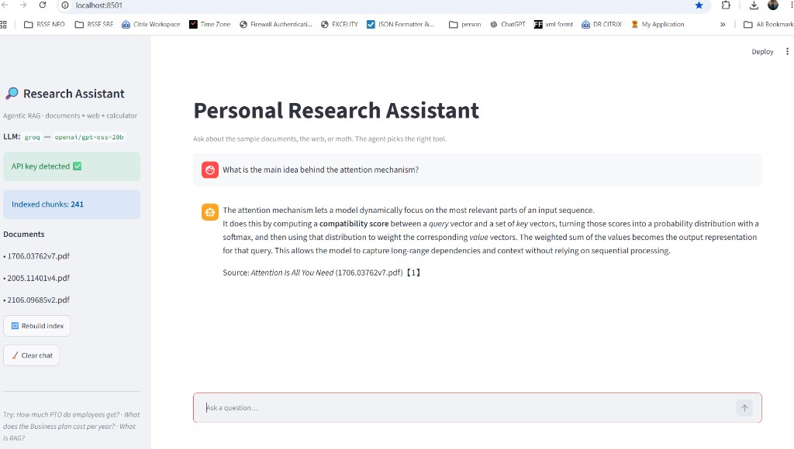

# 🔎 AI Research Assistant (Agentic RAG) — Cloud / Public Version

An AI assistant that answers questions by **choosing the right tool for the job**:

- 📄 **Document search (RAG)** over an indexed knowledge base
- 🌐 **Web search** (free DuckDuckGo, no API key) for current/general facts
- 🧮 **Calculator** for exact math

It is built with **LangGraph** (tool-calling ReAct agent), **Chroma** (vector
store), **FastEmbed** (lightweight local embeddings), and a **Groq** LLM
(free, fast). The same code also runs on OpenAI or a local Ollama model by
flipping one environment variable.

> This is the **publicly shareable** version: it ships with real, open-access
> **AI research papers** (Transformers, RAG, LoRA) from arXiv and a cloud LLM,
> so **anyone can run or deploy it** with a free API key.

---

## 🎬 Demo



*The agent recognizes a documents question, calls the `search_documents` tool,
retrieves the relevant chunks from the "Attention Is All You Need" PDF, and
answers with a source citation.*

---

## 🧠 How it works

```
                ┌──────────────────────────┐
   Question ──▶ │   ReAct Agent (LangGraph) │
                │   LLM = Groq / OpenAI /   │
                │         Ollama            │
                └────────────┬─────────────┘
                             │ decides which tool to call
        ┌────────────────────┼───────────────────────┐
        ▼                    ▼                         ▼
 search_documents        web_search                calculator
 (Chroma + FastEmbed)   (DuckDuckGo)              (safe arithmetic)
        │
   sample_docs/*.md,*.txt,*.pdf  ──indexed once──▶ Chroma vector store
```

The vector index is **built automatically on first run** from everything in
`sample_docs/`, so there is no manual setup step for deployment.

---

## 🛠️ Skills demonstrated (for your resume)

- Agentic AI with **tool-calling** and autonomous tool selection (LangGraph)
- **Retrieval-Augmented Generation (RAG)** with a vector database
- **Embeddings** + semantic search (FastEmbed / ONNX — no GPU, no torch)
- Multi-provider LLM abstraction (**Groq / OpenAI / Ollama**)
- Cloud deployment (**Streamlit Cloud / Hugging Face Spaces**) with secrets

---

## 🚀 Run it locally

### 1. Get a free Groq API key
Sign up at **https://console.groq.com** and create a key at
**https://console.groq.com/keys** (free tier, no credit card).

### 2. Install
```bash
cd ai-research-assistant-cloud
python -m venv .venv
# Windows:
.venv\Scripts\activate
# macOS/Linux:
source .venv/bin/activate

pip install -r requirements.txt
```

### 3. Add your key
Copy `.env.example` to `.env` and paste your key:
```
GROQ_API_KEY=your_key_here
```

### 4. Launch
```bash
streamlit run app.py
```
The first run downloads the small embedding model and builds the index
(a few seconds). Then open the URL Streamlit prints (usually
http://localhost:8501).

Try:
- *"What is the main idea behind the attention mechanism?"* (Transformer paper)
- *"How does retrieval-augmented generation reduce hallucination?"* (RAG paper)
- *"What problem does LoRA solve in fine-tuning?"* (LoRA paper)
- *"What is the latest version of Python?"* (falls back to web search)

---

## ☁️ Deploy so anyone can use it (free)

### Option A — Streamlit Community Cloud (easiest)
1. Push this folder to a **public GitHub repo**.
2. Go to **https://share.streamlit.io** → **New app** → pick your repo.
3. Set **Main file path** to `app.py`.
4. Under **Advanced settings → Secrets**, add:
   ```toml
   GROQ_API_KEY = "your_key_here"
   ```
5. Deploy. You get a public URL you can share with anyone.

### Option B — Hugging Face Spaces
1. Create a new **Space** → SDK: **Streamlit**.
2. Upload this folder (or connect the GitHub repo).
3. In **Settings → Variables and secrets**, add `GROQ_API_KEY`.
4. The Space builds and gives you a public URL.

---

## 🔁 Use your own documents
Drop `.md`, `.txt`, or `.pdf` files into `sample_docs/` (or set the `DOCS_DIR`
env var to another folder), then click **Rebuild index** in the sidebar
(or run `python -m src.ingest`).

> ⚠️ If you add **confidential** documents, do **not** deploy publicly and do
> **not** commit them. Use the local **Ollama** provider for privacy
> (`LLM_PROVIDER=ollama`) so nothing leaves your machine.

---

## ⚙️ Configuration (environment variables)

| Variable         | Default                    | Notes                                   |
|------------------|----------------------------|-----------------------------------------|
| `LLM_PROVIDER`   | `groq`                     | `groq` \| `openai` \| `ollama`          |
| `GROQ_API_KEY`   | —                          | required for Groq                       |
| `GROQ_MODEL`     | `llama-3.3-70b-versatile`  | or `llama-3.1-8b-instant` (faster)      |
| `OPENAI_API_KEY` | —                          | required if `LLM_PROVIDER=openai`       |
| `OPENAI_MODEL`   | `gpt-4o-mini`              |                                         |
| `OLLAMA_MODEL`   | `llama3.1`                 | for local, private use                  |
| `DOCS_DIR`       | `./sample_docs`            | folder to index                         |
| `TOP_K`          | `4`                        | chunks retrieved per query              |

---

## 📁 Project structure
```
ai-research-assistant-cloud/
├── app.py                 # Streamlit chat UI (auto-builds index)
├── config.py              # env-driven configuration
├── requirements.txt
├── .env.example
├── download_papers.py     # one-time helper to fetch arXiv PDFs
├── sample_docs/           # open-access AI papers, committed (swap in your own)
│   ├── 1706.03762v7.pdf   # Attention Is All You Need (Transformers)
│   ├── 2005.11401v4.pdf   # Retrieval-Augmented Generation
│   └── 2106.09685v2.pdf   # LoRA: Low-Rank Adaptation
├── docs/images/           # README screenshots
└── src/
    ├── store.py           # shared embeddings + Chroma vector store
    ├── loaders.py         # .md / .txt / .pdf loaders
    ├── ingest.py          # chunk + embed + persist (+ auto-build)
    ├── tools.py           # search_documents, web_search, calculator
    └── agent.py           # LangGraph ReAct agent + provider switch
```

---

## 📝 Resume bullet
> Built and deployed an **agentic RAG assistant** (LangGraph + Chroma + Groq LLM)
> that autonomously selects between **document retrieval, web search, and
> computation** tools to answer questions; ships with a multi-provider LLM
> abstraction (Groq/OpenAI/Ollama) and a one-click **Streamlit Cloud** deployment.
